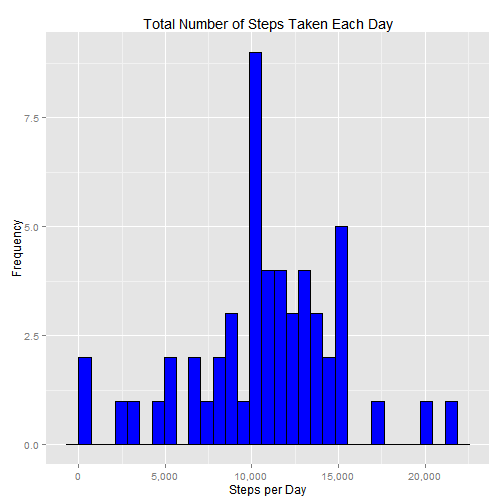
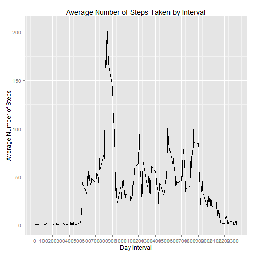
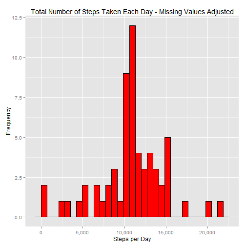
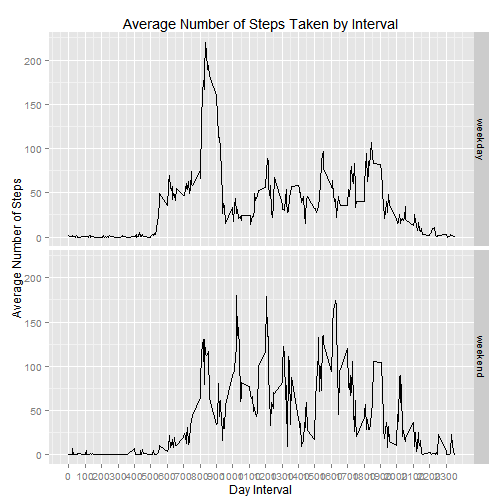

### Reproducible Research

## Package Required for the project


```r
library(ggplot2)
```

```
## Warning: package 'ggplot2' was built under R version 3.1.3
```

```r
library(dplyr)
```

```
## Warning: package 'dplyr' was built under R version 3.1.3
```

```
## 
## Attaching package: 'dplyr'
## 
## The following objects are masked from 'package:stats':
## 
##     filter, lag
## 
## The following objects are masked from 'package:base':
## 
##     intersect, setdiff, setequal, union
```

```r
library(scales)
```

```
## Warning: package 'scales' was built under R version 3.1.3
```

## 1) Loading and Preprocessing Data


```r
actDat <- read.csv("./activity.csv", header = TRUE, colClasses = c("numeric", "Date", "numeric"))
```

# In the above code instead of "./activity.csv" please provide your own path where data resides.

## What is mean total number of steps taken per day


```r
actDay <- actDat %.% group_by(date) %.% summarise(Steps = sum(steps))
```

```
## Warning: '%.%' is deprecated.
## Use '%>%' instead.
## See help("Deprecated")
```

```
## Warning: '%.%' is deprecated.
## Use '%>%' instead.
## See help("Deprecated")
```

## 1) Make a histogram of the total number of steps taken each day


```r
ggplot(data = actDay, mapping = aes(x = Steps)) + geom_histogram(fill = "blue", 
                                                                      colour = "black") + scale_x_continuous("Steps per Day", labels = comma) + 
  scale_y_continuous("Frequency") + ggtitle("Total Number of Steps Taken Each Day")
```

```
## stat_bin: binwidth defaulted to range/30. Use 'binwidth = x' to adjust this.
```

 

## 2) Calculate and report the mean and median total number of steps taken perday


```r
meanStepsDay <- mean(actDay$Steps, na.rm = TRUE)
formatC(meanStepsDay, big.mark = ",", format = "f", digits = 0)
```

```
## [1] "10,766"
```

```r
medianStepsDay <- median(actDay$Steps, na.rm = TRUE)
formatC(medianStepsDay, big.mark = ",", format = "f", digits = 0)
```

```
## [1] "10,765"
```

### What is the average daily activity pattern

```r
actInterval <- actDat %.% group_by(interval) %.% summarise(meanSteps = mean(steps, 
                                                                            na.rm = TRUE))
```

```
## Warning: '%.%' is deprecated.
## Use '%>%' instead.
## See help("Deprecated")
```

```
## Warning: '%.%' is deprecated.
## Use '%>%' instead.
## See help("Deprecated")
```

## 1) Make a time series plot


```r
ggplot(data = actInterval, mapping = aes(x = interval, y = meanSteps)) + 
  geom_line() + scale_x_continuous("Day Interval", breaks = seq(min(actInterval$interval), 
                                                                max(actInterval$interval), 100)) + scale_y_continuous("Average Number of Steps") + 
  ggtitle("Average Number of Steps Taken by Interval")
```

 

### Imputing missing values

## The presence of missing days may introduce bias into some calculations or summaries of the data.


```r
sum(is.na(actDat$steps))
```

```
## [1] 2304
```

#The dataset contains 2,304 missing values, around 13.1% of all the intervals

# for the filling I am going to use the mean instead of the missing value
# First I will merge the original data with the average by interval data


```r
actDat2 <- actDat %.% left_join(actInterval, by = "interval")
```

```
## Warning: '%.%' is deprecated.
## Use '%>%' instead.
## See help("Deprecated")
```

# now, I'm going to create a new column replacing the missing data with the
# average


```r
actDat2$fillSteps <- ifelse(is.na(actDat2$steps), actDat2$meanSteps, actDat2$steps)
```

# Now, I will drop the steps column as well as the meanSteps column, and
# then rename the fillSteps column as steps


```r
actDat2$steps <- NULL
actDat2$meanSteps <- NULL
colnames(actDat2) <- c("date", "interval", "steps")

actDat2 <- actDat2[, c(3, 1, 2)]
head(actDat2)
```

```
##       steps       date interval
## 1 1.7169811 2012-10-01        0
## 2 0.3396226 2012-10-01        5
## 3 0.1320755 2012-10-01       10
## 4 0.1509434 2012-10-01       15
## 5 0.0754717 2012-10-01       20
## 6 2.0943396 2012-10-01       25
```

##Make a histogram of the total number of steps taken each day and Calculate and report the mean and median total number of steps taken per day. Do these values differ from the estimates from the first part of the assignment? What is the impact of imputing missing data on the estimates of the total daily number of steps?

# create a new data frame with the number of steps per day using dplyr

```r
actDay2 <- actDat2 %.% group_by(date) %.% summarise(Steps = sum(steps))
```

```
## Warning: '%.%' is deprecated.
## Use '%>%' instead.
## See help("Deprecated")
```

```
## Warning: '%.%' is deprecated.
## Use '%>%' instead.
## See help("Deprecated")
```

```r
ggplot(data = actDay2, mapping = aes(x = Steps)) + geom_histogram(fill = "red", 
    colour = "black") + scale_x_continuous("Steps per Day", labels = comma) + 
    scale_y_continuous("Frequency") + ggtitle("Total Number of Steps Taken Each Day - Missing Values Adjusted")
```

```
## stat_bin: binwidth defaulted to range/30. Use 'binwidth = x' to adjust this.
```

 

##Calculate and report the mean and median total number of steps taken per day

```r
meanStepsDay2 <- mean(actDay2$Steps, na.rm = TRUE)
formatC(meanStepsDay2, big.mark = ",", format = "f", digits = 0)
```

```
## [1] "10,766"
```

```r
medianStepsDay2 <- median(actDay2$Steps, na.rm = TRUE)
formatC(medianStepsDay2, big.mark = ",", format = "f", digits = 0)
```

```
## [1] "10,766"
```

### Are there differences in activity patterns between weekdays and weekends?

##For this part the weekdays() function may be of some help here. Use the dataset with the filled-in missing values for this part.

##Create a new factor variable in the dataset with two levels - "weekday" and "weekend" indicating whether a given date is a weekday or weekend day.


```r
actDat2$weekdayType <- ifelse(weekdays(actDat2$date) %in% c("Satuday", "Sunday"), 
    "weekend", "weekday")

head(actDat2)
```

```
##       steps       date interval weekdayType
## 1 1.7169811 2012-10-01        0     weekday
## 2 0.3396226 2012-10-01        5     weekday
## 3 0.1320755 2012-10-01       10     weekday
## 4 0.1509434 2012-10-01       15     weekday
## 5 0.0754717 2012-10-01       20     weekday
## 6 2.0943396 2012-10-01       25     weekday
```

##Make a panel plot containing a time series plot (i.e. type = "l") of the 5-minute interval (x-axis) and the average number of steps taken, averaged across all weekday days or weekend days (y-axis).

# create a new data frame with the average number of steps per interval using dplyr


```r
actInterval2 <- actDat2 %.% group_by(interval, weekdayType) %.% summarise(meanSteps = mean(steps, 
    na.rm = TRUE))
```

```
## Warning: '%.%' is deprecated.
## Use '%>%' instead.
## See help("Deprecated")
```

```
## Warning: '%.%' is deprecated.
## Use '%>%' instead.
## See help("Deprecated")
```

```r
ggplot(data = actInterval2, mapping = aes(x = interval, y = meanSteps)) + 
    geom_line() + facet_grid(weekdayType ~ .) + scale_x_continuous("Day Interval", 
    breaks = seq(min(actInterval2$interval), max(actInterval2$interval), 100)) + 
    scale_y_continuous("Average Number of Steps") + ggtitle("Average Number of Steps Taken by Interval")
```

 
